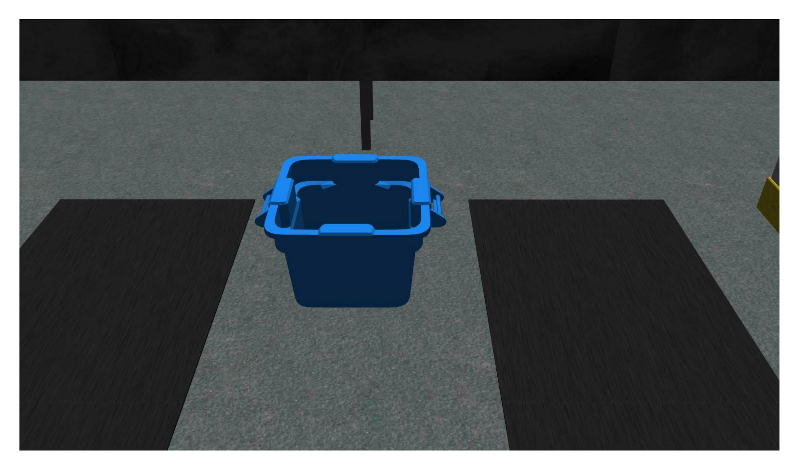

# Environment

The simulation environment is a representation of an order fulfillment workcell. An overview of the environment is provided in the figure below where each component is described in more details on this page.

## Robots

The workcell consists of two robots, which can perform pick-and-place operations. The other robots located in the workcell are automated guided vehicles (AGVs), which can be used to transport parts between stations.

### Ceiling Robot

The ceiling robot is a robot constituted of one torso attached to rails mounted on the ceiling. A UR10e arm is attached to the torso. The ceiling robot is capable of performing both kitting and assembly.

### Floor Robot

The floor robot is a UR10e arm which can move along a linear rail. The ceiling robot can only perform kitting.

### Automated Guided Vehicles (AGVs)

AGVs consist the third type of robots in the workcell. The main goal of AGVs is to move parts between stations or to the warehouse. 

*AGV with a kit tray and parts.*

Using a ROS service, competitors can move each AGV to a kitting station, to two assembly stations, and to the warehouse. In the figure below, each AGV is at its kitting station. The black path on the floor show the path each AGV can take. 

*Overview of AGVs and the designated spots they can reach.*

## Sensors

Competitors can place sensors around the environment in static locations. Sensors can be placed in any free space in the workcell. Sensors do not need to be attached to models in the environment. Sensors must be used in a realistic manner and must not exploit any simulation technicalities such as the logical camera seeing through obstructions. Each sensor has a cost that factors into the final score. Competitors can choose amoung six sensor/camera types.

### Break Beam

`break beam` reports when a beam is broken by an object. It does not provide distance information.

### Proximity

`proximity` outputs how far an object is from the sensor.

### Laser Profiler

`laser profiler` provides an array of distances to a sensed object.

### Lidar

`lidar` provides a point cloud of detected objects.

### RGB Camera

`rgb camera` provides an RGB image of objects.

### RGBD Camera

`rgbd camera` provides an RGB and depth information of scanned objects.

### Basic Logical Camera

`basic logical camera` provides only poses of detected objects. The type and the color of an object are not reported by this sensor.

### Advanced Logical Camera

`advanced logical camera` reports the pose, the type, and the color of a detected object.

## Bins

There are two types of bins in the workcell. Eight part bins are used to store parts needed during manufacturing tasks. Three part collectors  are used to properly discard parts.

### Part Bins

Eight part bins are located in the workcell. Each bin consists of nine slots and each slot can have 0 or 1 part. A part bin can be empty or can have up to nine parts. Part bins can have parts of different types, different colors, and different orientations. 

*Example of bins and parts.*

### Part Collectors

Three part collectors are provided to the competitors. These bins can be used to discard faulty parts as dropping these parts on the floor will lead to a penalty for the trial.

*Example of part collector.*

## Conveyor Belt

There is one conveyor belt in the workcell which is capable of moving a limited number of parts. The conveyor belt can move parts of different types. The order parts spawn on the conveyor belt can be `sequential` or `random`.

<!-- 

*Example of parts spawned sequentially.* -->

## Assembly Stations

Four assembly stations are present in the workcell. Assembly stations are used to perform assembly tasks. 

*Example of an assembly station.*

*Example of a complete assembly insert.*

## Parts

ARIAC consists of four different part types and five different colors for each type. Parts are used in both kitting and assembly. To be able to grasp parts, the robots have to use the part gripper.

## Kit Trays

For ARIAC 2023, the kitting trays have been redesigned to include a fiducial marker that denotes the ID of the tray (0–9). It also has lines denoting the quadrants.

During kitting, competitors are expected to place parts in quadrants.

## Quality Control Sensors

## Kit Tray/Tool Changer Station

The workcell consists of two kit tray/tool changing stations. Each station is used to store kit trays needed for kitting and up to three kit trays can be located on one single station.

The floor robot and the ceiling robot are both equipped with a vacuum gripper. The gripper requires contact with the part in order to grab an object. The gripper has two tool types: parts or trays and the color of the gripper will reflect the current state. To change the tool type for either robots, competitors must use the tool-changing stations at either of the two kitting stations. Competitors must move the robot they want to change the tool of to the corresponding tool changer and call a ROS service.

*One of the two stations with trays and tool changers.*

## Warehouse

The warehouse is only used when a kitting task is submitted. When a submission occurs, an AGV will go inside the warehouse with parts located on its back. If a submission is succesful, parts will be automatically removed from the AGV.

